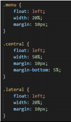
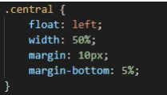

# Practica02---CSS

## 1. Crear un repositorio en GitHub con el nombre “Practica01 – Mi Blog”.

## 2. Diseño de 2 columnas

Como podemos observar se hicieron las 2 columnas correctamente, con la cabecera y el pié de
página correctamente ubicados.

El código es el siguiente: 

Usando el float left podemos hacer que el menú quede al lado de el
contenido, con lo que quedaran las dos columnas.
El menú ocupará un 20% de la página y el contenido un 70%

## 3. Diseño de 3 columnas

Como podemos observar se hicieron las 2 columnas correctamente, con la cabecera y el pié de
página correctamente ubicados. Usando el siguiente código.

De esta manera usando el float left podemos hacer que el menú, la parte
central y lateral puedan estar en diferentes columnas, dandole 20% al menú,
50% al margen y 20% al lateral.
Para la práctica se pedía una página de 2 columnas y una de 3, pero yo
use alternando algunas de 2 y otras de 3 en todas las páginas todas con
cabecera y pié de página.

## 4. Rutas relativas CSS

Todos los archivos CSS se encuentran en la carpeta “estilos” y desde las páginas son llamados.

De esta forma llaman las páginas

## 5. Selectores

En las páginas para las diferentes reglas de CSS usé varios selectores como por ejemplo:

De Clase:

De Etiqueta:

De ID:

Descendente:

## 6. Etiquetas personalizadas y Pseudo-clases

Usando selectores ID pude hacer que los textos de título y dos subtítulos tengan diferente tamaño, tipo de
letra y color. De la siguiente manera.

Las pseudo clases de los hipervínculos las realice de la siguiente manera:

El primer tipo lo use para los hipervínculos del menú, el segundo lo usé para los del pié de página y el tercero
para los hipervínculos de los laterales.

## 7. Menú lateral

Como se puede evidenciar en la imagen se presenta un menú
vertical con color de fondo, bordes circulares y separaciones de
5px entre sí.

## 8. Gama de Colores.

Los colores utilizados principalmente para la página son 3 uno verde simple un color blanco hueso y azul para
el menú

## 9. Numero de reglas

Las reglas utilizadas para la creación del diseño de las páginas pasan las 50 usando selectores de etiquetas,
clases, id y descendentes.

## 10. Comprobacion con la herramienta W3C

- 2 Columnas

- Reglas

- 3 Columnas

Como podemos observar en ninguna página existe error ni advertencia de algun tipo.

## 11. Formato de las páginas html

Se usó el siguiente formato:

La cabecera y el pié de página
tiene el exacto mismo formato, al
igual que el menú, el contenido y
la parte lateral cambia
dependiendo de la página, todo
esto manteniendo el mismo
formato explicado a más detalle
anteriormente.

- Las páginas siguen el
formato designado.

## 12. Commits y Readme en GitHub

El número de commits es el necesario como para evidenciar el avance en cada una de las dificultades
pedidas, realizando todo el trabajo a cabalidad. 

## CONCLUSIONES

Lo que más se puede destacar de este trabajo es la facilidad que existe al momento de usar
CSS en lugar del atributo style dentro de la etiqueta, pues nos permite hacer un trabajo más estandarizado,
poniendo el mismo diseño a las diferentes áreas que requerimos.
Con el uso de la herramienta W3C se puede realizar un trabajo más exacto.

